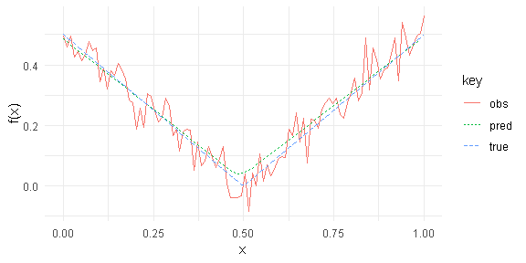
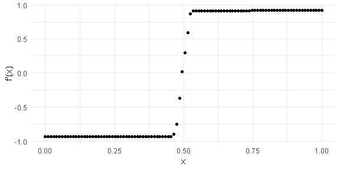

<!-- README.md is generated from README.Rmd. Please edit that file -->

# tvdiff

The **tvdiff** package is a simple R wrapper for the Python translation
of the Matlab TVDiff function. The package implements the methods found
in Rick Chartrand,“Numerical differentiation of noisy, nonsmooth data,”
ISRN Applied Mathematics, Vol. 2011, Article ID 164564, 2011.

## Installation

The **tvdiff** package is currently only available from Github.The
package depends on reticulate and requires Python to be
installed.

``` r
devtools::install_github("natbprice/tvdiff")
```

## Example



## References

Rick Chartrand, “Numerical differentiation of noisy, nonsmooth data,”
ISRN Applied Mathematics, Vol. 2011, Article ID 164564, 2011.

<https://sites.google.com/site/dnartrahckcir/home/tvdiff-code>

R package based on a Python translation by Simone Sturniolo:
<https://github.com/stur86/tvregdiff>
