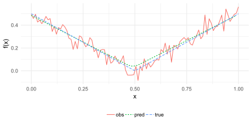
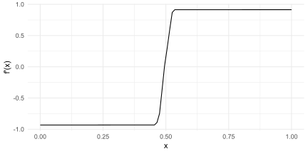

<!-- README.md is generated from README.Rmd. Please edit that file -->

# tvdiff

The **tvdiff** package is a simple R wrapper for the Python translation
of the original Matlab code by Rick Chartrand. The package implements
the methods found in Rick Chartrand,“Numerical differentiation of noisy,
nonsmooth data,” ISRN Applied Mathematics, Vol. 2011, Article ID 164564,
2011.

## Installation

The **tvdiff** package is currently only available from Github. The
package depends on reticulate and requires Python to be installed.

``` r
devtools::install_github("natbprice/tvdiff")
```

## Example

A simple example based on the function  = \\mid x - 0.5 \\mid") with Gaussian noise of standard deviation
0.05. The derivative is estimated from the noisy observations using
Total Variation Regularized Differentiation. A prediction of the
original function is obtained from the estimated derivative through
nummerical
integration.



## References

Rick Chartrand, “Numerical differentiation of noisy, nonsmooth data,”
ISRN Applied Mathematics, Vol. 2011, Article ID 164564, 2011.

<https://sites.google.com/site/dnartrahckcir/home/tvdiff-code>

R package based on a Python translation by Simone Sturniolo:
<https://github.com/stur86/tvregdiff>
