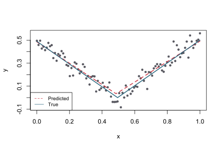
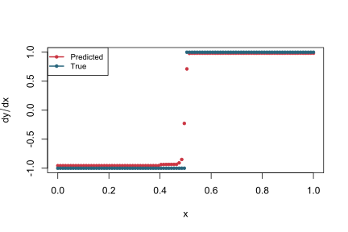

<!-- README.md is generated from README.Rmd. Please edit that file -->

# tvdiff

[](https://www.tidyverse.org/lifecycle/#maturing)
[](https://travis-ci.org/natbprice/tvdiff)
[](https://codecov.io/github/natbprice/tvdiff?branch=master)

The **tvdiff** package is an R translation of the Matlab implementation
of the Total Variation Regularized Numerical Differentiation algorithm
by Rick Chartrand. The package implements the methods found in Rick
Chartrand,“Numerical differentiation of noisy, nonsmooth data,” ISRN
Applied Mathematics, Vol. 2011, Article ID 164564, 2011.

## Installation

The **tvdiff** package is currently only available from Github.

``` r
devtools::install_github("natbprice/tvdiff")
```

## Example

A simple example based on the function  = \\mid x - 0.5 \\mid") with Gaussian noise of standard deviation
0.05. The derivative is estimated from the noisy observations using
Total Variation Regularized Differentiation. A prediction of the
original function is obtained from the estimated derivative through
numerical integration.

### Load demo data

``` r
data("smalldemodata")
str(smalldemodata)
#> 'data.frame':    100 obs. of  3 variables:
#>  $ x   : num  0 0.0101 0.0202 0.0303 0.0404 ...
#>  $ true: num  0.49 0.48 0.47 0.46 0.45 0.44 0.43 0.42 0.41 0.4 ...
#>  $ obs : num  0.495 0.459 0.496 0.427 0.444 ...
```

### Use `TVRegDiffR` to perform numerical integration on the demo data

``` r

# Data
x <- smalldemodata$x
obs <- smalldemodata$obs
true <- smalldemodata$true
dydx_true <- rep(-1, length(x))
dydx_true[x > 0.5] <- 1
dx <- x[2] - x[1]

# Extimate derivative
dydx <- TVRegDiffR(
  data = obs,
  iter = 1e3,
  alph = 0.2,
  scale = "small",
  ep = 1e-6,
  dx = dx
  )
dydx <- dydx[-1]

# Prediction
pred <- obs[1] + cumsum(dydx*dx)
```



## References

Rick Chartrand, “Numerical Differentiation of Noisy, Nonsmooth Data,”
ISRN Applied Mathematics, vol. 2011, Article ID 164564, 11 pages, 2011.
<https://doi.org/10.5402/2011/164564>.

**Matlab code:**
<https://sites.google.com/site/dnartrahckcir/home/tvdiff-code>

**Python translation:** <https://github.com/stur86/tvregdiff>

**C++ implementation of preconditioned conjugate gradient method:**
<https://github.com/styvon/cPCG>
