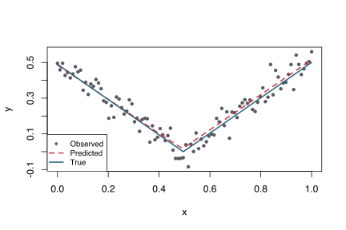
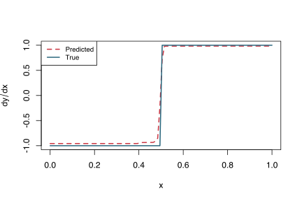

<!-- README.md is generated from README.Rmd. Please edit that file -->

# tvdiff

[](https://www.tidyverse.org/lifecycle/#maturing)
[](https://travis-ci.org/natbprice/tvdiff)
[](https://codecov.io/github/natbprice/tvdiff?branch=master)

The **tvdiff** package is a solution to the problem of how to estimate
the rate of change (i.e., derivative) when available data is noisy and
nonsmooth. If the data is noisy, then simple finite difference methods
of estimating the derivative are often inaccurate. If the data
generating process is nonsmooth, then fitting a smooth model to the data
in order to estimate the derivative may yield inaccurate estimates.

This package is based on the Matlab implementation of the Total
Variation Regularized Numerical Differentiation algorithm by Rick
Chartrand. This package uses a C++ method for the preconditioned
conjugate method based on the cPCG package. See
[references](#references) section.

## Installation

The **tvdiff** package is currently only available from
Github.

``` r
# Install development version from GitHub (install function requires devtools package)
devtools::install_github("natbprice/tvdiff")
```

**Installation and use requirements**: - R v. 4.0.1+ - C++ compiler -
Mac OS users will likely need to install GFortran, unless previously
installed. See [here](https://cran.r-project.org/bin/macosx/tools/) for
most recent binares (archived versions are unlikely to be compatible).
See
[here](https://thecoatlessprofessor.com/programming/r-compiler-tools-for-rcpp-on-macos/)
for further discussion regarding R compiler tools for R package
**Rcpp**.

## Example

A simple example based on the function  = \\mid x - 0.5 \\mid") with Gaussian noise of standard deviation
0.05. The derivative is estimated from the noisy observations using
Total Variation Regularized Differentiation. A prediction of the
original function is obtained from the estimated derivative through
numerical integration.

### Load demo data

Example data is included in the package for demonstration.

``` r
data("smalldemodata")
str(smalldemodata)
#> 'data.frame':    100 obs. of  3 variables:
#>  $ x   : num  0 0.0101 0.0202 0.0303 0.0404 ...
#>  $ true: num  0.49 0.48 0.47 0.46 0.45 0.44 0.43 0.42 0.41 0.4 ...
#>  $ obs : num  0.495 0.459 0.496 0.427 0.444 ...
```

### Estimate derivative

The `TVRegDiffR` function is used to estimate the derivative. The main
tuning parameter is the regularization parameter `alph`. Start by
varying `alph` by orders of magnitude until reasonable results are
obtained. The number of iterations `iter` must also be specified since
there is no default stopping criteria.

``` r

# Unpack data
x <- smalldemodata$x
obs <- smalldemodata$obs
true <- smalldemodata$true

# True derivative
dydx_true <- rep(-1, length(x))
dydx_true[x > 0.5] <- 1
dx <- x[2] - x[1]

# Extimate derivative
dydx <- TVRegDiffR(
  data = obs, # Vector of data to be differentiated
  iter = 1e3, # Number of iterations
  alph = 0.2, # Regularlization parameter
  dx = dx     # Grid spacing 
  )
dydx <- dydx[-1]

# Prediction
pred <- obs[1] + cumsum(dydx*dx)
```

### Plot results

For this simple example we can compare the estimates to the true
values.



## References

Rick Chartrand, “Numerical Differentiation of Noisy, Nonsmooth Data,”
ISRN Applied Mathematics, vol. 2011, Article ID 164564, 11 pages, 2011.
<https://doi.org/10.5402/2011/164564>.

**Matlab code:**
<https://sites.google.com/site/dnartrahckcir/home/tvdiff-code>

**Python translation:** <https://github.com/stur86/tvregdiff>

**C++ implementation of preconditioned conjugate gradient method:**
<https://github.com/styvon/cPCG>

## Disclaimer
*This software is preliminary or provisional and is subject to revision. It is being provided to meet the need for timely best science. The software has not received final approval by the U.S. Geological Survey (USGS). No warranty, expressed or implied, is made by the USGS or the U.S. Government as to the functionality of the software and related material nor shall the fact of release constitute any such warranty. The software is provided on the condition that neither the USGS nor the U.S. Government shall be held liable for any damages resulting from the authorized or unauthorized use of the software.*
